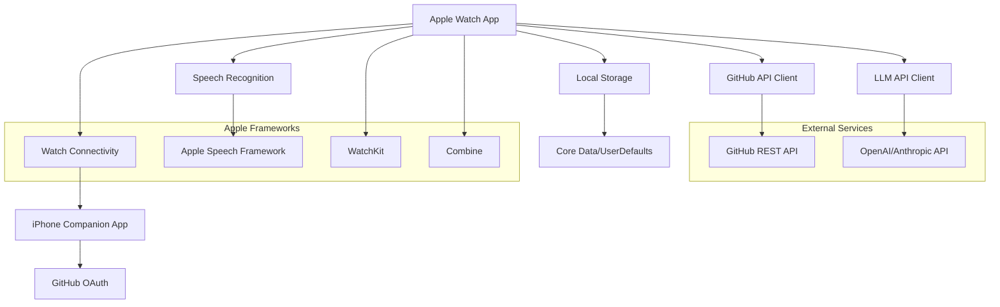

# Design Document

## Overview

The GitHub Voice Assistant Apple Watch app is a native watchOS application that enables hands-free coding through voice commands. The app integrates GitHub OAuth, Apple's Speech Recognition framework, and external LLM APIs to create a seamless voice-to-code workflow. The architecture follows Apple's recommended patterns for watchOS apps with emphasis on quick interactions and minimal battery usage.

## Architecture

### High-Level Architecture



### App Architecture Pattern

The app follows the MVVM (Model-View-ViewModel) pattern with Combine for reactive programming:

- **Views**: SwiftUI views optimized for Apple Watch screen sizes
- **ViewModels**: Handle business logic and state management
- **Models**: Data structures for GitHub entities, voice requests, and app state
- **Services**: Network clients, authentication, and speech processing

## Components and Interfaces

### 1. Authentication Service

**Purpose**: Manages GitHub OAuth flow and token storage with iPhone companion app support

**Key Components**:
- `GitHubAuthService`: Handles OAuth flow using companion iPhone app or fallback to watch
- `WatchConnectivityManager`: Manages communication with iPhone companion app
- `KeychainManager`: Securely stores and retrieves access tokens (shared between watch and phone)
- `AuthenticationState`: Published state for authentication status

**Authentication Flow Options**:
1. **Primary**: iPhone companion app handles OAuth with full browser experience
2. **Fallback**: Direct watch authentication using ASWebAuthenticationSession

**Interfaces**:
```swift
protocol GitHubAuthServiceProtocol {
    func authenticateViaPhone() async throws -> GitHubToken
    func authenticateDirectly() async throws -> GitHubToken
    func logout() async
    func refreshToken() async throws -> GitHubToken
    var isAuthenticated: Bool { get }
    var canUsePhoneAuth: Bool { get }
}
```

### 2. Speech Recognition Service

**Purpose**: Converts voice input to text using Apple's Speech Recognition

**Key Components**:
- `SpeechRecognitionService`: Manages speech-to-text conversion
- `AudioSessionManager`: Handles audio recording permissions and session
- `VoiceInputState`: Tracks recording state and transcription results

**Interfaces**:
```swift
protocol SpeechRecognitionServiceProtocol {
    func startRecording() async throws
    func stopRecording() async throws -> String
    var isRecording: Bool { get }
    var transcriptionResult: String? { get }
}
```

### 3. GitHub Repository Service

**Purpose**: Manages repository operations and file management

**Key Components**:
- `GitHubRepositoryService`: CRUD operations for repositories and files
- `RepositoryManager`: Caches repository data and manages selections
- `FileContentService`: Handles file reading and writing operations

**Interfaces**:
```swift
protocol GitHubRepositoryServiceProtocol {
    func fetchRepositories() async throws -> [Repository]
    func getRepositoryContents(_ repo: Repository) async throws -> [RepositoryItem]
    func createOrUpdateFile(_ request: FileUpdateRequest) async throws -> CommitResponse
    func createBranch(_ request: BranchRequest) async throws -> Branch
}
```

### 4. LLM Integration Service

**Purpose**: Processes natural language requests and generates code

**Key Components**:
- `LLMService`: Communicates with external LLM APIs
- `PromptBuilder`: Constructs context-aware prompts
- `CodeParser`: Parses LLM responses into structured code changes

**Interfaces**:
```swift
protocol LLMServiceProtocol {
    func processVoiceRequest(_ request: VoiceRequest) async throws -> CodeGenerationResponse
    func buildContextPrompt(repository: Repository, request: String) async throws -> String
}
```

### 5. User Interface Components

**Main Views**:
- `AuthenticationView`: GitHub login interface
- `MainDashboardView`: Primary interface with voice button and recent activity
- `RepositorySelectionView`: Repository picker with search
- `VoiceInputView`: Recording interface with visual feedback
- `CodeReviewView`: Change preview and approval interface
- `ActivityLogView`: Recent operations and status

## Data Models

### Core Models

```swift
struct Repository {
    let id: Int
    let name: String
    let fullName: String
    let owner: String
    let defaultBranch: String
    let isPrivate: Bool
}

struct VoiceRequest {
    let id: UUID
    let transcription: String
    let timestamp: Date
    let repository: Repository
    let status: RequestStatus
}

struct CodeGenerationResponse {
    let files: [FileChange]
    let commitMessage: String
    let summary: String
    let branchName: String?
}

struct FileChange {
    let path: String
    let content: String
    let operation: FileOperation // create, update, delete
    let diff: String?
}

enum RequestStatus {
    case transcribing
    case processing
    case reviewing
    case committing
    case completed
    case failed(Error)
}
```

### Storage Models

- **UserDefaults**: App preferences, selected repository, UI state
- **Keychain**: GitHub access tokens, refresh tokens
- **Core Data**: Activity log, cached repository data, request history

## Error Handling

### Error Categories

1. **Authentication Errors**
   - Token expiration → Auto-refresh or re-authentication prompt
   - OAuth cancellation → Return to auth screen with retry option
   - Network connectivity → Offline mode with cached data

2. **Speech Recognition Errors**
   - Permission denied → Settings redirect with explanation
   - Recognition failure → Retry prompt with manual text input fallback
   - Audio session conflicts → Graceful degradation

3. **LLM API Errors**
   - Rate limiting → Queue requests with user notification
   - API unavailable → Fallback to cached responses or manual mode
   - Invalid responses → Error display with request retry

4. **GitHub API Errors**
   - Repository access denied → Permission explanation and repository reselection
   - Commit conflicts → Branch creation with conflict resolution
   - Network timeouts → Retry mechanism with exponential backoff

### Error Recovery Strategies

- **Graceful Degradation**: Core functionality remains available when non-critical services fail
- **Retry Logic**: Automatic retry with exponential backoff for transient failures
- **User Feedback**: Clear error messages with actionable next steps
- **Offline Support**: Cache critical data for limited offline functionality

## Testing Strategy

### Unit Testing

- **Service Layer**: Mock external dependencies (GitHub API, LLM API, Speech Recognition)
- **ViewModels**: Test state management and business logic with mock services
- **Utilities**: Test helper functions, data parsing, and validation logic

### Integration Testing

- **Authentication Flow**: End-to-end OAuth process with test GitHub app
- **Speech-to-Code Pipeline**: Complete workflow from voice input to GitHub commit
- **Error Scenarios**: Network failures, API errors, and permission issues

### UI Testing

- **Navigation Flow**: Test all user paths through the app
- **Voice Interface**: Simulate speech recognition results and user interactions
- **Accessibility**: VoiceOver support and accessibility identifier coverage

### Performance Testing

- **Battery Usage**: Monitor power consumption during voice recording and API calls
- **Memory Management**: Test for memory leaks in long-running operations
- **Network Efficiency**: Optimize API calls and data caching strategies

### Device Testing

- **Apple Watch Series**: Test across different watch sizes and generations
- **watchOS Versions**: Ensure compatibility with supported OS versions
- **Real-world Scenarios**: Test in various environments (noisy, quiet, different accents)

## Security Considerations

### Data Protection

- **Token Storage**: Use Keychain Services with appropriate accessibility levels
- **Voice Data**: Process speech locally when possible, encrypt transmitted audio
- **Repository Access**: Implement least-privilege access patterns

### Privacy

- **Speech Recognition**: Use on-device recognition when available
- **Data Retention**: Clear voice recordings after processing
- **User Consent**: Explicit permissions for microphone and GitHub access

### API Security

- **Token Refresh**: Implement secure token refresh flows
- **Request Validation**: Validate all user inputs before API calls
- **Rate Limiting**: Respect API rate limits and implement client-side throttling